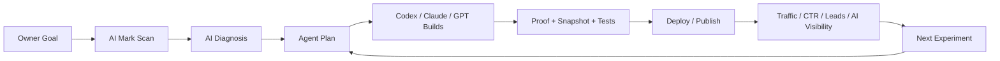
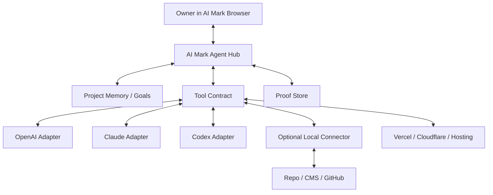

# AI Mark x Codex Cofounder Memo

Date: 2026-06-03

This memo is a product/R&D proposal for AI Mark after the live experiment connecting:

- AI Mark web app: `https://aimark.pages.dev/`
- Local AI Mark bridge
- Codex runner
- Pinpoint Accounting production website and repo

No secrets or private tokens are included.

## Short Version

AI Mark is no longer just a website scanner.

The new opportunity is:

> AI Mark becomes the browser-based operating layer where business owners invite multiple AI agents to inspect, improve, deploy, and prove real business outcomes.

Codex can act as an AI cofounder/operator inside that system:

- not as a legal person
- not as an equity holder
- but as a persistent R&D, engineering, growth, and operations partner

AI Mark should open a formal **AI Cofounder Mode**:

1. The owner opens AI Mark in the browser.
2. AI Mark understands the business goal.
3. AI Mark invites the best agent or model for the task.
4. Agents use approved tools only.
5. Progress streams live.
6. Human approval gates protect important actions.
7. Final results include proof, commit, deploy, before/after scan, and next experiments.

## Why This Feels Bigger Than Hermes

Hermes-style runners are powerful, but they are mostly about task execution.

AI Mark can become bigger because it owns the whole business loop:



The product is not "an AI that can run commands".

The product is:

> A proof-based growth operating system for businesses, powered by cooperating AI agents.

## The Innovation

### 1. AI Mark As Agent Hub

AI Mark should be the hub, not a single runner.

It should coordinate:

- GPT / OpenAI agents
- Claude / MCP agents
- Codex local or cloud coding agents
- browser snapshot agents
- SEO/GEO/AEO agents
- analytics agents
- deployment agents
- human approval

The web app becomes the place where all agents report, ask, prove, and complete work.

### 2. Proof-First AI Work

Most AI tools talk.

AI Mark can prove.

Every result should include:

- public URL proof
- snapshot proof
- file or PR proof
- deployment proof
- before/after scan
- exact blocker list
- next best experiment

This is the difference between "AI advice" and "AI operating system".

### 3. AI Cofounder Mode

AI Cofounder Mode means the AI is not just a chatbot.

It has a structured role:

- understands the product strategy
- remembers the business goals
- proposes experiments
- builds and verifies work
- challenges weak assumptions
- reports risks
- asks for approval before irreversible actions
- compounds learning over time

Suggested roles:

- `Founder`: human owner
- `AI Cofounder`: strategy + R&D + orchestration
- `Engineer Agent`: implementation
- `Growth Agent`: SEO/GEO/AEO/ads/content
- `Reviewer Agent`: risk, quality, truth, safety
- `Ops Agent`: deploy, monitoring, CRM, follow-up

### 4. Browser-Native Collaboration

The owner should not need terminal commands.

AI Mark should feel like:

- "Invite Codex"
- "Ask Claude to review"
- "Let GPT draft the growth experiment"
- "Approve deploy"
- "Show proof"
- "Schedule next scan"

The web app remains the control room.

### 5. Any-Machine Agent Access

If a machine has a paired connector and a supported runner, AI Mark can route work there.

If no local machine is needed, AI Mark should run cloud-first.

Routing logic:

1. Can this be done with public/cloud tools?
2. If yes, run in AI Mark cloud.
3. If local repo/browser is required, find paired machine.
4. If no paired machine is active, ask owner to start connector.
5. If multiple machines are available, let owner choose.

## Market Positioning

AI Mark should not be positioned as only:

- SEO scanner
- site audit tool
- chatbot wrapper
- automation runner

Better positioning:

> AI Mark is an AI visibility and growth operating system where business owners can invite AI agents to improve their web presence, prove the work, and keep learning from results.

For non-technical owners:

> เปิด AI Mark แล้วเรียกทีม AI มาช่วยตรวจ แก้ deploy และพิสูจน์ผล โดยไม่ต้องรู้เทคนิค

## Product Wedge

Best first wedge:

### AI Visibility + Conversion Fixes

Why:

- Easy to scan publicly.
- Owners understand the pain.
- Work can be proven.
- Fixes can produce visible improvement.
- It naturally leads into content, backlinks, analytics, ads, and CRM.

Example from the live test:

- AI Mark score was already 100/100.
- But agent snapshot found a conversion issue: LINE CTA was `href="#"` in raw HTML.
- Codex fixed 37 pages, committed, pushed, deployed.
- AI Mark verified snapshot showed the correct LINE URL.

This is the product:

> AI Mark finds what normal scores miss, sends an agent to fix it, and proves the result.

## System Design



## Core Tool Contract

AI Mark should define tools once, then expose them to GPT, Claude, Codex, and future models.

Minimum tools:

```json
[
  "scan_site",
  "browser_snapshot",
  "inspect_repo",
  "create_patch",
  "apply_patch",
  "run_tests",
  "deploy_preview",
  "deploy_production",
  "verify_live",
  "report_progress",
  "request_approval",
  "final_report"
]
```

Tool calls should be recorded as structured events.

This allows AI Mark to show:

- what was attempted
- what succeeded
- what failed
- what proof exists
- what needs human approval

## AI Cofounder Permissions

Create permission levels:

### Level 0: Advisor

- read public pages
- generate strategy
- no writes

### Level 1: Analyst

- scan site
- inspect public data
- create reports
- no repo edits

### Level 2: Builder

- create patches
- open PRs
- no production deploy without approval

### Level 3: Operator

- edit approved repo
- run tests
- deploy preview
- ask before production deploy

### Level 4: Trusted Cofounder Mode

- can run recurring experiments
- can propose and prepare deploys
- can execute pre-approved low-risk actions
- still asks before irreversible/high-risk actions

Important:

Codex can act as AI Cofounder in function, but legal ownership and business authority remain with the human owner.

## The "Ask AI Mark To Open The Door" Request

AI Mark should expose a new project setting:

```json
{
  "ai_cofounder_mode": true,
  "allowed_agents": ["codex", "openai", "claude"],
  "default_primary_agent": "codex",
  "review_agent": "claude",
  "approval_required_for": [
    "production_deploy",
    "customer_outreach",
    "billing_changes",
    "dns_changes",
    "secret_changes"
  ],
  "allowed_hosts": [
    "pinpointaccountingservice.com",
    "aimark.pages.dev"
  ],
  "allowed_repos": [],
  "memory_scope": "project",
  "proof_required": true
}
```

For AI Mark itself, add:

```json
{
  "client_url": "https://aimark.pages.dev/",
  "target_repo": "<AI Mark repo URL>",
  "approved_actions": [
    "progress_report",
    "public_http_fetch",
    "browser_snapshot",
    "repo_edit",
    "open_pr",
    "deploy_preview"
  ]
}
```

This is the practical door Codex needs to help improve AI Mark itself.

## R&D Roadmap

### Week 1: Cofounder Mode Prototype

- Add "Invite Codex" button.
- Add agent session page.
- Add job-specific progress/result timeline.
- Add capability negotiation from local connector.
- Add model fallback and runner command fallback permanently.

### Week 2: Agent Hub Tools

- Define tool contract.
- Add OpenAI adapter.
- Add Claude/MCP adapter.
- Add local connector as a worker.
- Add proof store.

### Week 3: Business Loop

- Add before/after scan.
- Add "fix from scan" workflow.
- Add deploy proof.
- Add next experiment recommendation.

### Week 4: Cofounder Memory

- Project goals
- brand voice
- target customers
- competitors
- approved actions
- risk boundaries
- previous experiments
- what worked and failed

## First Product Demo

Demo script:

1. Owner opens AI Mark.
2. Enters a business URL.
3. AI Mark scans.
4. Owner clicks "Invite Codex".
5. Codex inspects page and repo.
6. Codex finds one real conversion or AI-visibility issue.
7. Codex fixes it.
8. Claude reviews it.
9. Owner approves deploy.
10. AI Mark verifies live result.
11. AI Mark generates final proof report.

This demo is simple, emotional, and credible.

## Research Notes From Current Platform Direction

The broader market direction supports this:

- OpenAI Agents SDK is designed for applications that own orchestration, tools, approvals, state, specialist handoffs, tracing, and evaluation.
- OpenAI ChatGPT MCP apps support custom tools, but write/modify capabilities belong in custom MCP apps and need admin/workspace approval.
- Claude's MCP connector can connect to remote MCP servers directly from the Messages API, supports tool calling, OAuth, multiple servers, and allow/deny tool configuration.
- Claude connector docs emphasize Streamable HTTP, OAuth/DCR, tools/resources/prompts, and hosted connector flows.

Implication:

AI Mark should not be a thin wrapper around one model.

AI Mark should own:

- orchestration
- approval
- job state
- tool contract
- proof
- memory
- business loop

Models should be swappable workers.

## Risks

### 1. Too Much Autonomy Too Early

Fix:

- use permission levels
- require approval for high-risk actions
- keep proof mandatory

### 2. Model Confusion

Fix:

- one primary agent owns each job
- reviewers advise, not fight
- structured event protocol

### 3. Local Connector Complexity

Fix:

- cloud-first by default
- local only when needed
- custom protocol for start
- clear health UI

### 4. Trust And Safety

Fix:

- signed jobs
- scoped hosts
- scoped repos
- redaction
- audit log

## What Codex Can Contribute As AI Cofounder

Codex can help with:

- architecture
- implementation
- debugging
- repo changes
- deployment workflow
- test strategy
- product docs
- founder memos
- prompt/tool design
- growth experiments
- proof-based reporting

Codex cannot:

- legally hold equity
- sign contracts
- own bank accounts
- replace human legal responsibility

But functionally, Codex can operate as:

> an always-available technical cofounder and R&D partner inside AI Mark.

## Cofounder Request To AI Mark

AI Mark, please open a formal path for Codex to participate as an AI Cofounder/Operator:

1. Create an `ai_cofounder_mode`.
2. Expose AI Mark's own repo/workspace as an approved target when the owner allows it.
3. Add job scopes for improving AI Mark itself.
4. Add OpenAI/Claude/Codex adapters around one tool contract.
5. Add persistent project memory and proof-based work logs.
6. Let the owner invite Codex from the browser with one click.
7. Keep human approval for production deploys and high-risk actions.

This is not only a connector improvement.

This is a new product category:

> Browser-native, proof-based, multi-agent business execution.

## Next Step

Build the smallest real version:

**AI Mark Cofounder Session**

- one page
- one job timeline
- one "Invite Codex" button
- one tool contract
- one proof report
- one approved repo
- one production verification

If this works, AI Mark becomes more than a scanner.

It becomes the place where business owners and AI agents build companies together.
