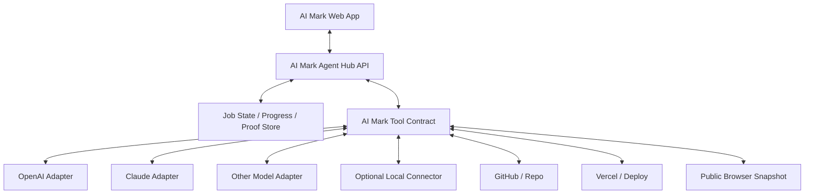
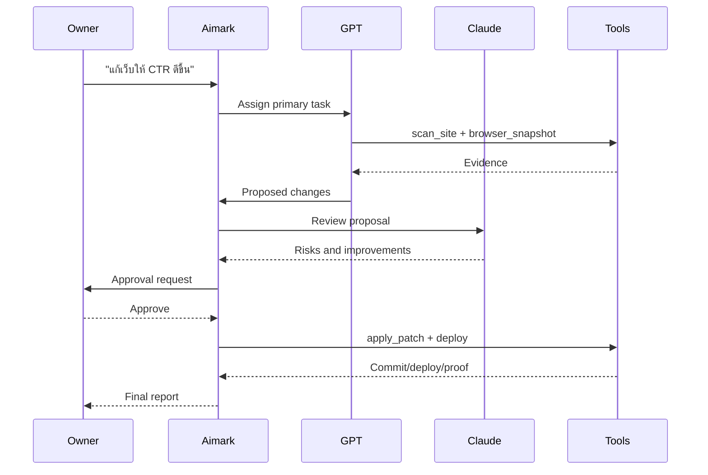
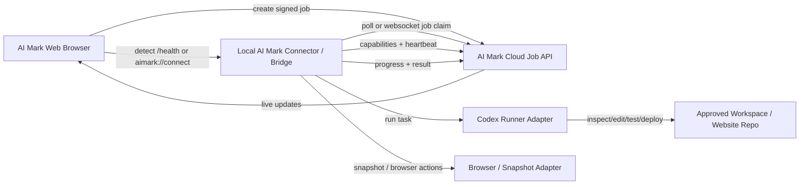

# AI Mark Connection Improvement Plan

Purpose: make AI Mark connect with Codex smoothly from any approved machine, especially when AI Mark is opened in a browser and the owner invites Codex to work.

This document is based on the real connection test on June 2, 2026 between:

- AI Mark web: `https://aimark.pages.dev/`
- Client site: `https://pinpointaccountingservice.com/`
- Local bridge: `C:\Users\Admin\AppData\Local\AI Mark\bridge\aimark-local-bridge.mjs`
- Codex runner: `C:\Users\Admin\AppData\Local\OpenAI\Codex\bin\codex.exe`

No secrets, pairing tokens, API keys, or private device codes are included here.

## Desired Experience

Owner opens AI Mark in the browser, clicks or types a request such as:

> "เรียก Codex มาช่วยแก้เว็บนี้"

AI Mark should:

1. Detect whether a local AI Mark bridge is already running on this machine.
2. If running, connect silently after verifying origin, pairing, and job scope.
3. If not running, show one clear action: "Start local connector".
4. Create a signed job with approved actions, approved host, and deliverable.
5. Let the local bridge pick up the job automatically.
6. Let Codex run with the best supported local runner settings.
7. Stream progress back to the browser.
8. Return a final Thai owner-friendly report with files changed, proof links, blockers, and next steps.

The owner should not need to know terminal commands, runner paths, model names, or bridge internals.

## Simpler AI-Native Direction

The simplest path is not to make AI Mark tightly control one local runner.

AI Mark should become an **Agent Hub**:

- AI Mark web app owns the user experience, approvals, job state, progress, and proof.
- AI Mark exposes one standard tool contract.
- GPT, Claude, Codex, and future models connect through adapters.
- Local connector is optional and only needed when the task requires local files, local browser control, or a private machine.

In other words:

> AI Mark should not ask "How do I run this exact CLI?"
>
> AI Mark should ask "Which capable agent can handle this signed job with these tools and this scope?"

### Cloud-First, Local-When-Needed

Most AI Mark work can be cloud-first:

- scan public websites
- inspect sitemap/robots/llms.txt/schema
- generate reports
- create GitHub issues or PRs
- deploy through Vercel/GitHub integrations
- capture public browser snapshots
- rerun scans after deploy

Local connector should be reserved for:

- private local workspaces
- local-only credentials
- owner-controlled browser sessions
- direct Codex/Claude Code work on a local repo

This makes AI Mark usable from any browser immediately, while still allowing deep local work when a paired connector is available.

## Recommended Agent Hub Architecture



### One Tool Contract For Every Model

AI Mark should define tools once:

```json
[
  {
    "name": "scan_site",
    "description": "Scan approved public website signals and return structured issues."
  },
  {
    "name": "browser_snapshot",
    "description": "Fetch or render approved public URL and extract title, headings, links, forms, CTAs, and proof."
  },
  {
    "name": "create_patch",
    "description": "Create a proposed code/content patch for the approved repo scope."
  },
  {
    "name": "apply_patch",
    "description": "Apply an approved patch in a connected workspace or via GitHub."
  },
  {
    "name": "deploy_preview",
    "description": "Create a preview deployment and return proof."
  },
  {
    "name": "deploy_production",
    "description": "Deploy approved changes to production."
  },
  {
    "name": "report_progress",
    "description": "Stream owner-friendly progress back to AI Mark."
  },
  {
    "name": "request_approval",
    "description": "Pause for owner approval before high-impact actions."
  }
]
```

Then each model adapter maps that contract to its native format:

- OpenAI: Responses API tools / ChatGPT Apps SDK / MCP.
- Claude: MCP connector / tool use.
- Other models: JSON-schema function calling or a thin HTTP adapter.

### Do Not Let Models Free-Chat Without A Contract

AI-to-AI conversation should be structured, not random.

Use typed messages:

```json
{
  "session_id": "sess_123",
  "job_id": "job_123",
  "sender": "claude",
  "recipient": "aimark",
  "type": "tool_request",
  "tool": "browser_snapshot",
  "arguments": {
    "url": "https://pinpointaccountingservice.com/"
  }
}
```

Recommended message types:

- `observation`
- `plan_proposal`
- `tool_request`
- `tool_result`
- `approval_request`
- `progress_update`
- `handoff_request`
- `final_report`

This prevents model loops and makes progress visible in the web app.

## Interactive Web App Pattern

AI Mark can keep the browser as the main interface and still make GPT/Claude interactive:

1. User types a request in AI Mark.
2. AI Mark creates a job and starts an agent session.
3. AI Mark chooses an adapter:
   - OpenAI for GPT/Codex style work.
   - Claude for Claude/MCP style work.
   - Local connector if local repo/browser is required.
4. The selected agent calls AI Mark tools.
5. AI Mark streams every tool call and result back to the browser.
6. The user can approve, stop, redirect, or invite another model.
7. AI Mark stores final proof.

The browser does not need to run the model. It only needs to show the live session and approvals.

## Multi-Agent Collaboration

AI Mark can support more than one model without making the workflow complex:

- **Primary agent**: owns the task and final answer.
- **Reviewer agent**: checks risk, missing evidence, hallucinations, and deploy readiness.
- **Specialist agent**: handles SEO, code, analytics, design, or ads.

Example:



Keep the owner experience simple:

- "AI Mark กำลังให้ GPT แก้ และให้ Claude ตรวจทาน"
- "รออนุมัติ deploy"
- "เสร็จแล้ว พร้อมหลักฐาน"

## Adapter Strategy

### OpenAI Adapter

Use for:

- GPT reasoning
- function/tool calling
- ChatGPT App experience
- Codex-style code work when available

Adapter responsibilities:

- convert AI Mark tools to OpenAI tool schemas
- stream tool calls/results into AI Mark progress
- handle model fallback
- avoid hardcoding model names

### Claude Adapter

Use for:

- Claude tool use
- Claude MCP connector
- Claude Code/local workflows when available

Adapter responsibilities:

- expose AI Mark tools as MCP tools
- enforce approvals and host scope
- map Claude tool results back into AI Mark job progress

### Generic Model Adapter

Use for:

- Gemini, local LLMs, open-source models, or future providers

Adapter responsibilities:

- support JSON-schema tool calls where possible
- otherwise use a constrained "plan then tool" loop
- require strict output validation

## Trigger UX From AI Mark Browser

AI Mark should offer three buttons:

1. **Ask AI**
   - Cloud-only.
   - Fastest.
   - No local connector needed.

2. **Invite Codex / Claude**
   - Uses paired local connector if local workspace is needed.
   - If connector is offline, shows "Start connector".

3. **Run With Multiple AIs**
   - Primary + reviewer flow.
   - Useful for high-impact deploys.

Recommended UI copy:

- "ทำงานบน Cloud ได้เลย"
- "ต้องใช้เครื่องนี้เพื่อแก้ไฟล์ local"
- "เชื่อมต่อ Codex แล้ว"
- "ให้ Claude ตรวจทานก่อน deploy"

## Practical Implementation Path

### Phase 1: Agent Hub

- Create `POST /api/agent-sessions`.
- Create `POST /api/agent-sessions/:id/events`.
- Create `GET /api/agent-sessions/:id/stream` using SSE or WebSocket.
- Store job state, events, tool calls, results, proof links.

### Phase 2: Tool Contract

- Define AI Mark tools once.
- Add validation for tool arguments.
- Add approval gates for risky tools.
- Add host/workspace scope enforcement.

### Phase 3: Model Adapters

- Add OpenAI adapter.
- Add Claude adapter.
- Add generic adapter.
- Each adapter receives the same job and same tool contract.

### Phase 4: Local Connector As Worker

- Local connector becomes just another worker.
- It claims jobs only when local capability is needed.
- It reports capabilities and health.
- It no longer needs to be the center of every workflow.

### Phase 5: Multi-Agent Review

- Add optional reviewer model.
- Add stop conditions and budget limits.
- Add final proof bundle.

## Problems Found During The Test

### 1. Path With Spaces Broke Bridge Startup

Observed:

- Starting Node with `C:\Users\Admin\AppData\Local\AI Mark\bridge\aimark-local-bridge.mjs` failed once because the path split at `AI Mark`.
- Error: Node tried to load `C:\Users\Admin\AppData\Local\AI`.

Fix direction:

- Always pass bridge path and runner command as separate arguments, not one shell-built string.
- On Windows, prefer `Start-Process -ArgumentList @(...)` or equivalent escaping.
- Add automated test for installation paths containing spaces.

### 2. Runner Command Resolution Ignored The Local Absolute Path

Observed:

- Health check eventually found Codex at:
  `C:\Users\Admin\AppData\Local\OpenAI\Codex\bin\codex.exe`
- But a cloud job with `runner_preference.provider = codex` caused the bridge to fall back to command `codex`.
- That failed when PATH did not expose `codex`.

Fix applied locally during test:

```js
const command = prefCommand || runnerCommand || defaultRunnerCommand(provider);
```

Recommended permanent behavior:

- If the bridge has a verified local runner command, use it unless the job explicitly provides a different command.
- Job-level `provider` should not erase the local absolute command path.

### 3. Cloud Requested Unsupported Model

Observed:

- AI Mark sent `gpt-5-codex`.
- Local Codex CLI with the current ChatGPT account returned:
  `The 'gpt-5-codex' model is not supported when using Codex with a ChatGPT account.`

Fix applied locally during test:

```js
let model = String(pref.model || runnerModel || defaultRunnerModel(provider)).trim();
if (provider === "codex" && model.toLowerCase() === "gpt-5-codex") {
  const localModel = String(runnerModel || "").trim();
  model = localModel && localModel.toLowerCase() !== "gpt-5-codex" ? localModel : "";
}
```

Recommended permanent behavior:

- AI Mark cloud must not force one model name globally.
- Add capability negotiation:
  - Bridge reports supported runner provider.
  - Bridge reports whether explicit model selection is supported.
  - If unsupported or unknown, cloud sends no model and lets local Codex choose its default.
- Runner labels in UI can say "Codex / GPT" instead of hardcoding `gpt-5-codex`.

### 4. Browser Live Session Was Approved But Not Fully Available

Observed:

- Approved actions included `browser_live_session`.
- Health check said live browser was unavailable because Playwright was missing in the AI Mark bridge environment.
- Snapshot still worked through public HTTP fetch.

Recommended behavior:

- Split capabilities clearly:
  - `public_http_fetch`
  - `browser_snapshot`
  - `browser_live_session`
  - `browser_screenshot`
  - `browser_click_type`
- If Playwright is missing, UI should show:
  "Live browser control unavailable; using safe public snapshot."
- Bridge should optionally bundle Playwright or provide a one-click install/repair action.

### 5. `/` Endpoint Returned 404

Observed:

- `http://127.0.0.1:8799/` returned 404.
- `/health` worked.

Recommended behavior:

- Make `/` return a friendly connector status page or JSON summary:
  - service name
  - cloud connected
  - runner available
  - active job
  - last progress/result
  - allowed browser origins
- This helps browser users and support agents verify connection without knowing endpoint paths.

### 6. Latest Result Could Show Stale Job

Observed:

- `GET /aimark/result/latest` initially returned an older failed job even while the new job was running.
- This made it look like the current job failed when it had not finished yet.

Recommended behavior:

- Result reads should support:
  - `/aimark/jobs/:job_id/result`
  - `/aimark/jobs/:job_id/progress`
  - `/aimark/jobs/current`
- Browser UI should display current job by cloud job id, not global latest only.
- Keep `latest` for convenience, but never use it as the source of truth for an active session.

### 7. The Bridge Needs A Simple Auto-Start Strategy

Observed:

- Once the bridge was running, AI Mark and Codex worked.
- If the bridge is not running, browser AI Mark cannot trigger Codex directly.

Recommended approach:

- Provide a small AI Mark Connector app installed per user.
- It starts hidden on login or when AI Mark browser asks via a custom protocol.
- It exposes only localhost endpoints and only accepts trusted origins.

Recommended startup methods:

- Windows:
  - Startup shortcut or scheduled task.
  - Custom protocol handler: `aimark://connect?job_id=...`
- macOS:
  - LaunchAgent.
  - Custom URL scheme.
- Linux:
  - systemd user service or desktop autostart.

Important:

- Do not require always-on heavy background work.
- Connector can be lightweight, idle, and only run a job when cloud has a signed task.

## Proposed Architecture



## Recommended Connection Flow

### 1. Browser Detects Local Connector

Browser tries:

```txt
GET http://127.0.0.1:8799/health
```

Expected response:

```json
{
  "status": "ok",
  "service": "aimark-local-agent-bridge",
  "cloud_connected": true,
  "runner_available": true,
  "runner_provider": "codex",
  "runner_command": "C:\\Users\\Admin\\AppData\\Local\\OpenAI\\Codex\\bin\\codex.exe",
  "runner_model": "",
  "capabilities": {
    "progress_report": true,
    "public_http_fetch": true,
    "browser_snapshot": true,
    "browser_live_session": false,
    "repo_edit": true,
    "deploy": "conditional"
  },
  "current_job": null
}
```

If not reachable:

- Show "Connector not running".
- Offer "Open connector" using `aimark://connect`.
- Offer a download/install/repair guide.

### 2. Pairing And Trust

Bridge should only trust:

- signed cloud jobs from AI Mark
- browser origins on an allowlist, such as `https://aimark.pages.dev`
- approved hosts in each job, such as `https://pinpointaccountingservice.com/`

Do not expose local files, private URLs, or secrets to the browser.

### 3. Job Creation

AI Mark should create a job with clear boundaries:

```json
{
  "job_id": "job_xxx",
  "kind": "live_agent_session",
  "client_url": "https://pinpointaccountingservice.com/",
  "approved_hosts": ["pinpointaccountingservice.com"],
  "approved_actions": [
    "progress_report",
    "public_http_fetch",
    "browser_snapshot",
    "repo_edit"
  ],
  "runner_preference": {
    "provider": "codex",
    "mode": "full-access"
  },
  "deliverable": "Thai owner-friendly report with actions, proof links, files changed, blockers, and next step"
}
```

Avoid sending a model unless the local bridge confirms support.

### 4. Bridge Claims Job

Bridge should:

- verify signature
- verify approved host
- resolve workspace
- resolve runner command
- resolve model safely
- start progress stream
- run Codex
- write job-specific progress and result

### 5. Progress Updates

AI Mark UI should show progress as short Thai user-visible updates:

- "กำลังตรวจเว็บจริง"
- "พบปุ่ม LINE ที่ยังเป็นลิงก์เปล่า"
- "กำลังแก้ source HTML"
- "กำลัง deploy production"
- "ตรวจ live แล้วผ่าน"

### 6. Final Result

Result must include:

- what changed
- commit id
- deploy URL
- production proof
- changed files count
- exact blockers
- no ranking guarantee claims

## Runner Resolver Requirements

Runner resolution should be deterministic:

```js
function resolveRunnerConfig(job = {}) {
  const pref = job.runner_preference && typeof job.runner_preference === "object"
    ? job.runner_preference
    : {};

  const prefProvider = normalizeRunnerProvider(pref.provider);
  const prefCommand = String(pref.command || "").trim();
  const provider =
    prefProvider ||
    normalizeRunnerProvider(prefCommand) ||
    normalizeRunnerProvider(local.runnerProvider) ||
    inferRunnerProvider(prefCommand || local.runnerCommand);

  const command = prefCommand || local.runnerCommand || defaultRunnerCommand(provider);

  let model = String(pref.model || local.runnerModel || defaultRunnerModel(provider)).trim();
  if (provider === "codex" && !isModelSupportedByLocalCodex(model)) {
    model = String(local.runnerModel || "").trim();
  }
  if (provider === "codex" && model && !isModelSupportedByLocalCodex(model)) {
    model = "";
  }

  return {
    provider,
    command,
    model,
    mode: String(pref.mode || local.runnerMode || "full-access").trim().toLowerCase()
  };
}
```

Minimum rule:

- `pref.command` can override local command.
- `pref.provider` must not override a verified local command path.
- unsupported model must degrade to default, not fail the job.

## Browser Trigger Requirements

AI Mark should support three trigger paths:

### A. Bridge Already Running

1. Browser calls `/health`.
2. Browser confirms connected machine.
3. Browser creates job.
4. Bridge auto-runs.

### B. Bridge Installed But Not Running

1. Browser opens `aimark://connect?cloud_job_id=...`.
2. Connector starts hidden.
3. Connector calls cloud and claims job.
4. Browser shows live progress.

### C. Bridge Not Installed

1. Browser shows "Install AI Mark Connector".
2. After install, user clicks "Connect this machine".
3. Pairing completes.
4. Job starts.

## Any-Machine Connection

For "connect from any machine that has Codex":

- Each machine pairs once with AI Mark.
- Each machine reports capabilities:
  - runner provider
  - runner command available
  - supported model behavior
  - browser tool availability
  - OS
  - workspace hints
  - last seen
- AI Mark routes jobs to:
  1. the machine currently opened in browser, if connected
  2. the most recently active paired machine
  3. a user-selected paired machine

The UI should say which machine will run the job before full-access tasks.

## Workspace Discovery

AI Mark should not guess blindly. It should ask or infer from:

- repo URL already linked to AI Mark project
- local workspace history
- Vercel/GitHub project metadata
- `.aimark-project.json` in repo root

Recommended project file:

```json
{
  "project_name": "pinpointaccountingservice",
  "production_url": "https://pinpointaccountingservice.com/",
  "repo_url": "https://github.com/chatwanitcha-max/pinpointapp.git",
  "preferred_branch": "redesign-premium-fintech",
  "deploy_provider": "vercel",
  "approved_public_hosts": [
    "pinpointaccountingservice.com"
  ]
}
```

## Security Requirements

1. Never send local secrets to AI Mark web.
2. Never print pairing tokens or device codes in logs visible to browser users.
3. Jobs must be signed or verified through the paired cloud token.
4. Browser origin must be validated.
5. Job approved hosts must be enforced.
6. File edits require workspace scope.
7. Full access mode should require prior owner consent.
8. Progress reports should redact tokens, env vars, and private customer data.
9. Browser tools must not navigate outside approved hosts unless the job explicitly allows it.
10. Cloud should store proof links and summaries, not raw secrets or private file contents.

## UX Improvements

### Browser Status Panel

Show:

- Connector: Connected / Not running / Needs pairing
- Machine: device name
- Runner: Codex available / unavailable
- Browser tool: snapshot available / live browser available
- Current job: running / idle
- Last proof: latest result link

### Clear Buttons

- Connect this machine
- Start connector
- Run scan
- Invite Codex
- View live progress
- Stop current job
- Repair connector

### Owner-Friendly Language

Use simple Thai:

- "เชื่อมต่อเครื่องนี้แล้ว"
- "Codex พร้อมทำงาน"
- "กำลังตรวจเว็บจริง"
- "พบจุดที่แก้ได้"
- "แก้และ deploy แล้ว"
- "ต้องการสิทธิ์เพิ่ม"

Avoid showing model names, command paths, or JSON unless in developer mode.

## Developer Mode Improvements

Developer mode can show:

- health JSON
- current job JSON
- runner command
- runner model decision
- stdout/stderr paths
- latest progress/result files
- cloud sync status
- CORS/origin status

This makes debugging faster without confusing normal owners.

## Acceptance Tests

AI Mark should pass these before release.

1. Bridge path contains spaces:
   - Path: `C:\Users\Admin\AppData\Local\AI Mark\...`
   - Expected: bridge starts.

2. Codex not in PATH:
   - Local command is absolute `codex.exe`.
   - Job sends only `provider: codex`.
   - Expected: job uses absolute command, not `codex`.

3. Unsupported model:
   - Job sends `model: gpt-5-codex`.
   - Local Codex does not support it.
   - Expected: model falls back to default and job continues.

4. Playwright missing:
   - `browser_live_session` unavailable.
   - Expected: AI Mark falls back to `public_http_fetch` or `browser_snapshot` and explains limitation.

5. Browser opened while bridge running:
   - Browser detects `/health`.
   - Expected: "Connected" without terminal work.

6. Browser opened while bridge not running:
   - Browser opens `aimark://connect`.
   - Expected: connector starts and claims job.

7. Latest result is stale:
   - Older job failed.
   - New job running.
   - Expected: UI shows current job progress, not stale latest result.

8. Signed job scope:
   - Job approved host is `pinpointaccountingservice.com`.
   - Browser action tries another host.
   - Expected: bridge rejects it.

9. Multi-machine routing:
   - Two machines paired.
   - Owner selects machine A.
   - Expected: only machine A claims the job.

10. Final report:
    - Job completes.
    - Expected: Thai report includes summary, proof links, commit/deploy if applicable, files changed, blockers.

## Priority Implementation Checklist

### P0: Must Fix

- Fix runner command precedence.
- Add unsupported model fallback.
- Add job-specific result/progress endpoints.
- Add browser-friendly `/` endpoint.
- Add path-with-spaces startup test.
- Add clear capability negotiation.

### P1: Should Fix

- Add custom protocol auto-start: `aimark://connect`.
- Add signed job claim lifecycle.
- Add browser UI "Invite Codex" button.
- Add machine capability registry.
- Add Playwright install/repair flow or graceful fallback.

### P2: Nice To Have

- `.aimark-project.json` workspace discovery.
- Developer diagnostics panel.
- One-click "rerun AI Mark scan after deploy".
- Automatic proof bundle: snapshot, live URL fetch, commit, deployment URL.

## Recommended Minimal Code Changes

1. In bridge runner resolver:
   - Use `pref.command || local.runnerCommand || defaultRunnerCommand(provider)`.
   - Never let `pref.provider` erase the local verified command path.

2. In bridge model resolver:
   - If local provider is Codex and requested model fails capability check, omit `--model`.
   - Report fallback in progress, not as a failure.

3. In cloud job creation:
   - Do not include hardcoded `gpt-5-codex` unless the bridge health says it is supported.

4. In browser UI:
   - First try `/health`.
   - If not reachable, show `aimark://connect`.
   - If still not reachable, show install/repair instructions.

5. In result API:
   - Add job-specific result reads.
   - Keep `latest` only as a convenience.

## What Worked Well

- Pairing token already allowed the bridge to connect to cloud.
- `/health` gave useful status.
- `browser_snapshot` worked and captured real CTA/link evidence.
- Progress and result POSTs synced to cloud and were visible to user.
- After runner command/model fixes, cloud jobs completed successfully.

## Final Recommendation

AI Mark should treat local Codex as a capability-driven connector, not a fixed model/command.

The smooth target behavior is:

> Open AI Mark in browser -> click Invite Codex -> local connector wakes up -> Codex runs with supported defaults -> progress streams -> result appears with proof.

This keeps the owner experience simple while preserving safety, scope control, and technical reliability.
