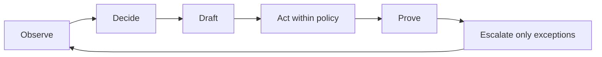

# AI Mark Owner Operator Mode

Purpose: turn the work AI Mark has already started into a practical business-owner autopilot for four high-leverage areas:

1. Website + SEO + AI visibility
2. Lead capture + follow-up
3. LINE/email/customer inbox
4. Content calendar

The goal is not full unchecked autonomy. The goal is:

> The owner can step away from routine work while AI Mark keeps the business moving, proves what happened, and escalates only what needs human judgment.

## Product Promise

Thai:

> AI Mark ช่วยให้เจ้าของพักได้ โดยเว็บ ลีด follow-up inbox และ content ยังเดินต่อ พร้อมหลักฐานและจุดที่ต้องอนุมัติ

English:

> AI Mark lets owners step away while website growth, lead follow-up, inbox triage, and content operations keep moving with proof and owner control.

## Operating Model

AI Mark should run a daily loop:



### Observe

Collect current signals:

- website status, robots, sitemap, schema, llms.txt, key CTAs
- new leads from forms, chat, LINE, email, CRM
- stale leads that need follow-up
- inbox messages that need triage
- content queue and publishing cadence
- AI visibility opportunities and gaps

### Decide

Classify every item:

- safe to do now
- draft for human approval
- needs specialist review
- blocked by missing access
- high risk, owner must decide

### Draft

Prepare human-quality work:

- reply drafts
- follow-up messages
- page edits
- FAQ/AEO snippets
- content briefs
- daily summary

### Act Within Policy

Execute low-risk actions automatically:

- send internal alerts
- create follow-up queue items
- update content calendar
- run public scans
- draft replies
- open issues/tasks
- apply low-risk website fixes only when permission allows

### Prove

Every action must create proof:

- source signal
- action taken
- timestamp
- file/URL/message proof
- owner-visible summary
- next step

### Escalate

Escalate only when needed:

- legal/tax/accounting judgment
- payment, billing, or contract
- DNS, secrets, bank, irreversible change
- sensitive customer message
- complaint or high-risk case
- production deploy above policy

## Four Workstreams

### 1. Website + SEO + AI Visibility

Goal:

- Keep the public website technically healthy.
- Keep AI-readable signals strong.
- Convert scan findings into real fixes.

Daily checks:

- homepage 200
- key service pages 200
- robots.txt 200
- sitemap.xml 200
- llms.txt 200
- canonical present
- title/meta/H1 present
- schema present
- top CTA links are not empty or broken
- AI crawler allow rules still present
- sitemap recently reflects priority pages

Weekly checks:

- stale page scan
- broken internal link scan
- FAQ/AEO content gap
- AI answer gap questions
- competitor/entity visibility notes
- content performance queue

Autonomous actions:

- create scan summary
- create issue list
- patch obvious broken CTA links
- add internal links where mapped in content plan
- prepare FAQ/schema improvements
- submit final proof after deploy

Approval required:

- changing brand claims
- legal/tax promises
- deleting pages
- production deploy if risk is not low
- changing DNS/headers/payment/analytics credentials

KPIs:

- public scan score
- broken CTA count
- broken link count
- indexed priority URL count
- AI-readable pages count
- answer-first page count

### 2. Lead Capture + Follow-Up

Goal:

- Every lead gets classified and moved to a next step quickly.
- Owner sees only leads that need judgment or closing.

Lead states:

- new
- hot
- warm
- cold
- waiting_for_customer
- waiting_for_owner
- booked
- won
- lost
- no_response

Hot lead rules:

- phone, deadline, urgent wording, visa/work permit, tax deadline, company registration soon
- target response: 15 minutes during business hours
- AI Mark can draft reply and alert owner/operator immediately

Warm lead rules:

- service interest but missing phone/deadline/documents
- target response: 4 hours
- AI Mark can send checklist draft or create follow-up task

Cold lead rules:

- vague browsing, no contact, no service need
- AI Mark can add to nurture/content retargeting queue

Autonomous actions:

- deduplicate lead
- classify urgency
- route by service type
- draft first reply
- create follow-up schedule
- summarize missing information
- send internal LINE/email notification
- update lead queue

Approval required:

- quote/pricing commitment
- legal/tax advice
- sensitive refusal
- customer complaint
- sending outbound message to people without consent or prior relationship

KPIs:

- first response time
- follow-up completion rate
- hot lead response SLA
- booked calls
- stale leads
- no-response leads recovered

### 3. LINE/Email/Customer Inbox

Goal:

- Inbox should never silently pile up.
- AI Mark triages, drafts, and escalates.

Inbox classifications:

- new lead
- active customer
- document request
- deadline risk
- pricing question
- complaint
- spam
- partner/vendor
- unknown

Autonomous actions:

- acknowledge receipt when policy allows
- draft reply
- identify service intent
- extract contact details
- detect missing documents
- create task for owner/team
- summarize thread
- update lead/customer status

Human review required:

- final advice on accounting/tax/legal/DBD/work permit
- angry customer or complaint
- price negotiation
- anything involving government deadline interpretation
- messages with personal/sensitive documents

Suggested inbox UX:

- "AI Mark drafted 8 replies"
- "3 need owner approval"
- "2 deadline-risk cases"
- "5 safe follow-ups ready"

KPIs:

- untriaged messages
- average inbox age
- draft acceptance rate
- escalation count
- customer response SLA

### 4. Content Calendar

Goal:

- Convert questions, leads, and AI answer gaps into publishable content.
- Keep content tied to conversion pages and business outcomes.

Inputs:

- Google PAA/questions
- AI answer gaps
- lead questions
- LINE/email repeated questions
- Search Console queries
- service priorities
- seasonal deadlines
- competitor/entity gaps

Calendar states:

- idea
- brief_ready
- draft_ready
- review_required
- approved
- published
- refresh_needed

Autonomous actions:

- cluster questions
- prepare brief
- generate draft
- add CTA mapping
- suggest internal links
- prepare FAQ schema
- schedule refresh
- update sitemap after publishing

Approval required:

- publishing claims about regulation/deadlines
- pricing pages
- brand positioning changes
- medical/legal/financial advice beyond general information

KPIs:

- briefs ready
- articles published
- pages refreshed
- internal links added
- leads attributed to content
- AI answer gap pages created

## Daily Owner Brief

AI Mark should send one concise daily brief:

```txt
วันนี้ AI Mark ทำอะไรให้แล้ว

Website:
- หน้าเว็บหลักปกติ 200
- ไม่พบ CTA เสีย
- พบ 2 หน้าที่ควร refresh FAQ

Leads:
- ลีดใหม่ 4 ราย
- hot 1 ราย รอ owner approve ข้อความตอบ
- warm 2 ราย ส่ง checklist draft แล้ว

Inbox:
- LINE 6 ข้อความ triage แล้ว
- 1 เคสเกี่ยวกับ deadline ต้องให้ทีมตรวจ

Content:
- เตรียม brief ใหม่ 2 เรื่องจากคำถามลูกค้า
- 1 บทความรอ review

ต้องการคุณ:
1. อนุมัติข้อความตอบ hot lead
2. ตรวจเคส deadline-risk
```

## Owner Away Mode

Owner sets:

- away dates
- emergency contact
- daily report time
- maximum autonomous action level
- max ad/spend/deploy risk
- which message types AI Mark can send
- which cases require owner approval

Default policy:

- AI Mark can observe, classify, draft, queue, notify, and summarize.
- AI Mark can send low-risk acknowledgement messages only if the channel has prior customer relationship and policy allows.
- AI Mark must not promise price, outcome, legal/tax judgment, or government approval.

## AI Mark UI Improvements

Add four dashboard cards:

1. Website Health + AI Visibility
2. Lead Follow-Up
3. LINE/Email Inbox
4. Content Calendar

Each card should show:

- status
- what AI did
- what is waiting for owner
- proof
- next action button

Primary buttons:

- Run daily operator loop
- Approve replies
- Invite Codex to fix site
- Generate content brief
- Publish daily owner brief

## Minimum MVP

Build this first:

1. Read existing operations config.
2. Run public website scan.
3. Load recent lead/inbox samples.
4. Classify leads hot/warm/cold.
5. Generate reply drafts from follow-up playbook.
6. Generate content ideas from repeated questions.
7. Create one daily owner brief.
8. Ask approval only for risky replies or deploys.

This is enough to show:

> AI Mark can keep the business moving while the owner is away.

## Implementation Notes

This repo already has useful building blocks:

- `operations/agent-os.config.json`
- `operations/campaign-queue.json`
- `operations/follow-up-playbook.json`
- `operations/lead-inbox.sample.json`
- `operations/runtime/follow-up-queue.json`
- `marketing/line-reply-templates-and-sales-scripts.md`
- `marketing/SEO_KEYWORD_MAP_TOPIC_PLAN_30_DAYS.md`
- `content/` FAQ and service datasets
- `api/lead.js`
- `api/line-webhook.js`
- `api/ai-chat.js`

AI Mark should treat these as seed memory for an Owner Operator workspace.

## Next Engineering Step

Create an endpoint or job type:

```json
{
  "kind": "owner_operator_daily_loop",
  "client_url": "https://pinpointaccountingservice.com/",
  "workstreams": [
    "website_ai_visibility",
    "lead_follow_up",
    "inbox_triage",
    "content_calendar"
  ],
  "mode": "assist",
  "approval_required": true
}
```

Output:

- owner brief markdown
- action queue JSON
- approval queue JSON
- proof bundle JSON

